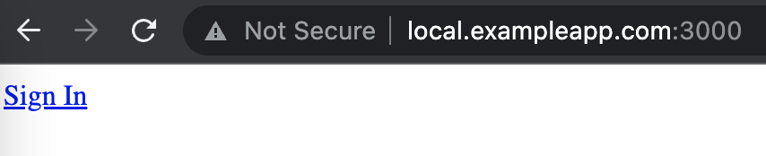

# Riot Developer Example App
This project is a consumption example of [Riot Games Developer API](https://developer.riotgames.com/apis) (RGAPI).

All endpoints requires authentication and there are two ways of authentication:

## API Keys
Anyone who signs into the developer portal will automatically be granted an API key that will be associated with their account. Your API key allows you to start using the API immediately, and allows us to generate API usage metrics for your key. [See example](#summoner-overview).

For more information about API Keys read the [full docs](https://developer.riotgames.com/docs/portal#web-apis_api-keys).

## RSO Authentication (OAUTH2)
Some endpoints requires authorization from the user, and for this purpose RGAPI uses [oauth2](https://oauth.net/2/) protocol. [See example](#my-account).

# Project Setup
To setup this project locally a few steps are needed, they are:
- [Configure environment variables](#configure-environment-variables)
- [Add rule for localhost domain (only for oauth2 authentication)](#add-rule-for-localhost-domain-only-for-oauth2-authentication)
- [Boot Golang server](#boot-golang-server)

## Configure environment variables
### API Key
You can get the API Key after sign in at [Riot Games Developer Portal](https://developer.riotgames.com/login). This token will be used as environment variable `RIOT_API_TOKEN`.

### Get credentials for oauth2
For oauth2 authentication are needed two credentials, they are `CLIENT_ID` and `CLIENT_SECRET` and will be used respectively for environment variables `RSO_CLIENT_ID` and `RSO_CLIENT_SECRET`.

Contact us if you'd like to request access for oauth2.

### Create .env file
Copy file `.env.example` to a new file named `.env`.

#### MacOS and Linux
```bash
cp .env.example .env
```

#### Windows
```
copy .env.example .env
```

### Update .env file
Set the environment variables with the credentials created in the last steps. For example:
```
APP_PORT=3000
RSO_CLIENT_ID=<YOUR-CLIENT-ID>
RSO_CLIENT_SECRET=<YOUR-CLIENT-SECRET>
RIOT_API_TOKEN=<YOUR-RIOT-API-TOKEN>
```

If you are not going to test oauth2 authentication, leave `RSO_CLIENT_ID` and `RSO_CLIENT_SECRET` empty.

## Add rule for localhost domain (only for oauth2 authentication)
To use oauth2 authentication redirect flows is needed to match your app hostname with the `redirect_uri` provided when [getting credentials for oauth2](#get-credentials-for-oauth2).

If you are not going to test oauth2 authentication, go to step [Golang](#golang).

### Windows
Open hosts file `C:\Windows\System32\Drivers\etc\hosts` \
Add your hostname to localhost ip
```
127.0.0.1  local.exampleapp.com
```

### MacOS and Linux
Open hosts file ` /etc/hosts` \
Add your hostname to localhost ip
```
127.0.0.1  local.exampleapp.com
```
> Linux users will need to edit hosts file as superuser (sudo)

## Boot Golang server
### Version
You must have golang `1.18` version or higher. To check golang version
```golang
go version
```

### Install dependencies
Download module dependencies
```golang
go mod download
```

### Boot server
Simply run the following command to start your Golang server
```golang
go run main.go
```

# Examples
## Summoner overview

### Use case
For this example we have a use case of retrieving a summoner's league entries. The expected inputs are summoner's name and region.

The data we want can be retrieved at endpoint [/lol/league/v4/entries/by-summoner/{encryptedSummonerId}](https://developer.riotgames.com/apis#league-v4/GET_getLeagueEntriesForSummoner) that returns summoner's league entries and expects a summoner encrypted ID.

With our input we can consume endpoint [/lol/summoner/v4/summoners/by-name/{summonerName}](https://developer.riotgames.com/apis#summoner-v4/GET_getBySummonerName) and obtain summoner's encrypted ID.

### Consuming the APP
After [booting server](#boot-golang-server) make a request `GET localhost:3000/summoners/overview?region={summonerRegion}&name={summonerName}`

Available regions are:
- BR1
- EUN1
- EUW1
- JP1
- KR
- LA1
- LA2
- NA1
- OC1
- RU
- TR1

#### Using curl
```bash
curl -X GET "localhost:3000/summoners/overview?region={region}&name={summonerName}"
```

#### Using browser
Navigate to `localhost:3000/summoners/overview?region={region}&name={summonerName}`

#### Example response
```json
{
    "id": "summonerID",
    "name": "SummonerName",
    "profileIconId": 1,
    "summonerLevel": 10,
    "revisionDate": "2022-01-17T18:14:50-03:00",
    "leagueEntries": [
        {
            "leagueId": "leagueID",
            "queueType": "RANKED_SOLO_5x5",
            "tier": "CHALLENGER",
            "rank": "I",
            "leaguePoints": 1071,
            "wins": 194,
            "losses": 164,
            "hotStreak": true,
            "veteran": true,
            "freshBlood": false,
            "inactive": false
        }
    ]
}
```

## My Account
For this example we will authenticate through RSO (Riot SSO) and request account data by using oauth2 access token.

1. Open the example app with the [host you defined](#add-rule-for-localhost-domain-only-for-oauth2-authentication)
2. Follow the `Sign In` link



You will be redirected to Riot SSO Login Page. Authenticate using your account credentials.


After login you will be redirected to local app. The app will request [/riot/account/v1/accounts/me](https://developer.riotgames.com/apis#account-v1/GET_getByAccessToken) using an access token of your account.
```json
{
    "puuid": "Player Universal Unique ID",
    "gameName": "Game Name",
    "tagLine": "Tag Line"
}
```
> The json values are only examples. For puuid you will receive an encrypted string.
